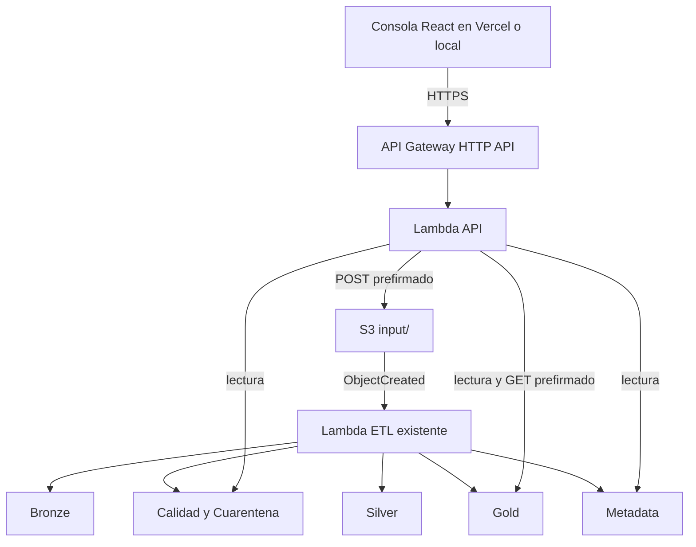

## AUTOR
SANTIAGO VIZCARRA DE LA SOTA

# RetailFlow

Plataforma serverless para ingestión, validación y transformación de datos minoristas. RetailFlow procesa archivos pequeños y medianos mediante AWS Lambda, Amazon S3 y AWS SAM, y ofrece una consola web React para cargar archivos y consultar el resultado de una ejecución.

## Resumen

RetailFlow implementa un flujo de datos por capas:

```text
Archivo de entrada
        |
        v
Bronze -> Calidad -> Silver -> Gold
                    |
                    +-> Cuarentena
        |
        +-> Metadata e idempotencia SHA-256
```

El sistema mantiene una frontera de entrada controlada en S3, conserva los datos originales en Bronze, separa los registros inválidos en Cuarentena, normaliza los registros válidos en Silver y genera salidas analíticas Gold en Parquet.

## Arquitectura

La solución está dividida en dos stacks independientes:



### Stack ETL

`retailflow-serverless-etl` contiene:

- Un bucket S3 cifrado con bloqueo de acceso público.
- Una Lambda ETL que orquesta todas las etapas.
- Un layer propio para dependencias de Excel y YAML.
- El layer público AWS SDK for pandas para pandas y PyArrow.
- Un trigger S3 filtrado por el prefijo `input/`.
- Un grupo de logs de CloudWatch con retención de 14 días.

### Stack API

`retailflow-web-api` contiene:

- Una HTTP API de API Gateway.
- Una Lambda para autorizar cargas y leer resultados.
- Permisos mínimos sobre el bucket existente.
- CORS para el origen del frontend.

La API nunca recibe el contenido del archivo. El navegador obtiene un POST prefirmado y carga directamente en S3. La Lambda ETL existente continúa siendo responsable del procesamiento.

## Flujo de procesamiento

1. El usuario selecciona un dataset y un archivo CSV, JSON o XLSX.
2. La consola solicita al API una autorización temporal.
3. El navegador carga el archivo directamente en `input/<dataset>/<upload_id>/`.
4. S3 invoca la Lambda ETL existente.
5. Bronze conserva los datos de entrada con metadata de ingestión.
6. Las reglas YAML validan tipos, campos obligatorios, rangos y duplicados.
7. Los registros inválidos se escriben en Cuarentena.
8. Los registros válidos se transforman a Silver y después a Gold.
9. La ejecución se registra en `metadata/runs/`.
10. El checksum SHA-256 se registra en `metadata/processed/` para evitar reprocesamientos.

Una carga repetida con los mismos bytes produce el estado `SKIPPED` y referencia la ejecución original. Las ejecuciones fallidas no se marcan como procesadas, por lo que pueden reintentarse después de corregir el archivo.

## Datasets admitidos

| Dataset | Formato recomendado | Clave principal |
| --- | --- | --- |
| `sales` | CSV o XLSX | `sale_id` |
| `customers` | CSV | `customer_id` |
| `products` | CSV | `product_id` |
| `stores` | CSV | `store_id` |
| `payments` | JSON | `payment_id` |
| `inventory` | XLSX | `inventory_id` |

La consola incluye un Excel de ventas listo para usar en [`frontend/public/examples/retailflow_ventas_ejemplo.xlsx`](frontend/public/examples/retailflow_ventas_ejemplo.xlsx).

## Estructura del repositorio

```text
RetailFlow/
├── config/                       # Configuración de datasets y calidad
├── docs/                         # Documentación técnica y operativa
├── events/                       # Eventos para invocación local
├── frontend/                     # Consola React + TypeScript + Vite
│   ├── public/examples/          # Archivos de ejemplo descargables
│   └── src/                      # Componentes, páginas y cliente API
├── infrastructure/               # Parámetros y notas de infraestructura
├── layers/etl-dependencies/      # Dependencias del layer propio
├── sample_data/                  # Datos válidos e inválidos para pruebas
├── scripts/                      # Automatización local y despliegues
├── src/retailflow_etl/           # Pipeline ETL
├── src/retailflow_api/           # API HTTP para la consola
├── tests/                        # Pruebas unitarias e integración
├── template.yaml                 # Stack ETL
├── template-api.yaml             # Stack API
├── pyproject.toml                # Configuración Python, Ruff y Mypy
└── requirements-dev.txt          # Herramientas de desarrollo
```

## Requisitos

- Python 3.12 o superior.
- AWS CLI configurado con un perfil autorizado.
- AWS SAM CLI.
- Docker Desktop activo para builds compatibles con Lambda.
- Node.js y npm para la consola web.

No guardes access keys, tokens ni archivos `.env` reales en el repositorio.

## Instalación local

Desde la raíz del proyecto:

```powershell
python -m venv .venv
.\.venv\Scripts\Activate.ps1
python -m pip install --upgrade pip
python -m pip install -r lambda/requirements.txt
python -m pip install -r requirements-dev.txt
```

Para instalar las dependencias del frontend:

```powershell
cd frontend
npm.cmd install
```

## Configuración

El archivo `.env.example` contiene la configuración base del pipeline. Crea un `.env` local solo cuando necesites ejecutar herramientas que lo utilicen.

Para la consola, copia `frontend/.env.example` a `frontend/.env.local` y define la URL del API:

```env
VITE_API_BASE_URL=https://<api-id>.execute-api.us-east-1.amazonaws.com
```

Las variables expuestas a Vite deben comenzar con `VITE_`. No coloques credenciales AWS en el frontend.

## Ejecución local

Con el API desplegado o disponible en un endpoint accesible:

```powershell
cd frontend
$env:VITE_API_BASE_URL = "https://<api-id>.execute-api.us-east-1.amazonaws.com"
npm.cmd run dev -- --host 0.0.0.0
```

La consola estará disponible en `http://localhost:5173`.

La interfaz permite:

- Descargar el Excel de ejemplo.
- Cargar un archivo directamente a S3.
- Esperar el resultado asíncrono de la ejecución.
- Ver metadata, vista previa Gold, calidad y descargas de resultados.
- Consultar la arquitectura desplegada.

## Pruebas y calidad

Pruebas del backend:

```powershell
pytest
ruff check src tests scripts
mypy src
```

Validación y build de SAM:

```powershell
sam validate --template-file template.yaml
sam validate --template-file template-api.yaml
sam build --template-file template.yaml --use-container
sam build --template-file template-api.yaml --use-container
```

Pruebas del frontend:

```powershell
cd frontend
npm.cmd test -- --run
npm.cmd run lint
npm.cmd run build
```

Las pruebas del backend utilizan repositorios en memoria y no requieren acceso a AWS.

## Despliegue del stack ETL

Usa un nombre de bucket globalmente único y un perfil AWS local:

```powershell
.\scripts\deploy.ps1 `
  -Profile <perfil-aws> `
  -Region us-east-1 `
  -StackName retailflow-serverless-etl `
  -Environment dev `
  -BucketName <bucket-globalmente-unico>
```

El bucket tiene `DeletionPolicy: Retain`. No se elimina automáticamente durante la eliminación del stack.

Para destruir el stack, el script requiere confirmación explícita:

```powershell
.\scripts\destroy.ps1 `
  -Profile <perfil-aws> `
  -Region us-east-1 `
  -StackName retailflow-serverless-etl `
  -EmptyBucket
```

## Despliegue del API

El API reutiliza el bucket del stack ETL:

```powershell
.\scripts\deploy_api.ps1 `
  -Profile <perfil-aws> `
  -Region us-east-1 `
  -StackName retailflow-web-api `
  -Environment dev `
  -BucketName <bucket-etl-existente> `
  -AllowedOrigin http://localhost:5173
```

El origen permitido debe coincidir exactamente con el origen del frontend. Para Vercel, usa el dominio de producción, por ejemplo `https://retailflow.vercel.app`.

El bucket S3 también necesita CORS para aceptar el POST directo desde el navegador. Configura como mínimo el origen del frontend y los métodos `POST`, `GET` y `HEAD`.

No elimines ni reemplaces el stack `retailflow-serverless-etl` para actualizar la API. Los stacks son independientes.

## Despliegue del frontend en Vercel

1. Importa el repositorio en Vercel.
2. Define `frontend` como **Root Directory**.
3. Usa `npm run build` como comando de build.
4. Usa `dist` como directorio de salida.
5. Define `VITE_API_BASE_URL` con la URL del API Gateway.
6. Despliega primero una preview y después producción.

El archivo `frontend/vercel.json` contiene rewrites para que React Router funcione al recargar rutas como `/about` y `/runs/<run-id>`. Vercel documenta el despliegue de proyectos Vite en su [guía oficial](https://vercel.com/docs/frameworks/frontend/vite).

Después del primer despliegue, actualiza `AllowedOrigin` del API y CORS de S3 con el dominio final de Vercel. Los dominios de preview son distintos del dominio de producción y deben autorizarse por separado si se van a utilizar.

## Contrato del API

```text
POST /uploads
GET  /uploads/{uploadId}
GET  /runs
GET  /runs/{runId}
GET  /runs/{runId}/result
GET  /runs/{runId}/errors
GET  /runs/{runId}/download
GET  /runs/{runId}/quarantine-download
```

`POST /uploads` valida dataset, nombre, extensión, tipo MIME y tamaño máximo de 10 MB. Devuelve un POST prefirmado de 5 minutos limitado a `input/*`.

`GET /uploads/{uploadId}` devuelve `PROCESSING`, `SUCCESS`, `FAILED` o `SKIPPED`. Las respuestas de ejecución incluyen conteos, tiempos, keys de S3 y referencias de idempotencia.

## Seguridad y control de costos

- El navegador nunca recibe credenciales AWS.
- Las cargas y descargas usan URLs prefirmadas de corta duración.
- La API solo escribe en `input/*` y lee metadata, Gold y Cuarentena.
- El bucket bloquea acceso público y usa cifrado del lado del servidor.
- El tamaño máximo de archivo es 10 MB.
- Los logs se retienen durante 14 días.
- No se usan bases de datos, colas, Glue, Spark ni concurrencia aprovisionada.
- La política de retención del bucket evita borrar datos por accidente.

## Limitaciones

El pipeline procesa un objeto por invocación y no realiza validación referencial entre archivos. Para volúmenes mayores convendría incorporar una estrategia distribuida, conciliación por manifiestos y políticas de evolución de esquemas.

## Documentación adicional

- [Descripción de arquitectura](docs/architecture.md)
- [Diccionario de datos](docs/data_dictionary.md)
- [Reglas de calidad](docs/data_quality_rules.md)
- [Estructura S3](docs/s3_structure.md)
- [Guía de despliegue](docs/deployment.md)
- [Consola de operaciones](docs/operations_console.md)
- [Estrategia de pruebas](docs/testing.md)


