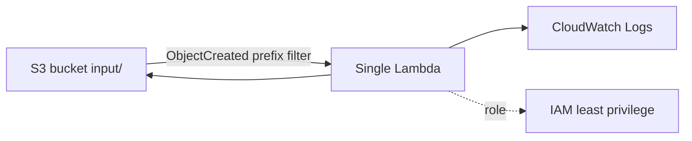

# AWS architecture

CloudFormation provisions one encrypted private S3 bucket, one Lambda function, one Lambda dependency layer, one least-privilege role and one CloudWatch log group. The bucket notification has an `input/` prefix filter. This is the critical recursion control: Bronze, Silver, Gold, Quarantine and metadata writes cannot trigger the function.

